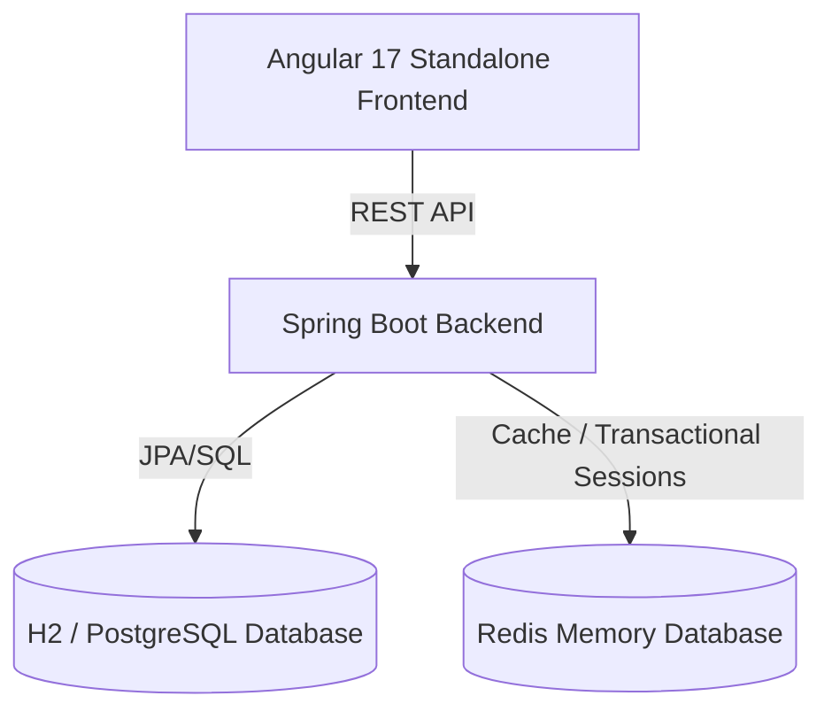

# Challenge E-Commerce Application (Gila)

An enterprise-grade e-commerce application exercise demonstrating contract-first development, bulk async imports, Redis transactional state management, and modern component architectural design.

---

## Technical Stack & Architecture



### 1. Backend Core Features
- **Products Catalog**: Standard RESTful endpoints for listing, filtering, and CRUD operations.
- **Bulk CSV Product Import**: Asynchronous import queue utilizing multi-threaded batch operations. Provides polling endpoints for real-time progress tracking (`QUEUED`, `PROCESSING`, `COMPLETED`, `FAILED`).
- **Redis Shopping Cart**: High-performance cart management utilizing transactional Redis sessions mapped to authenticated user sessions.
- **Purchase Checkout**: Validates product stock and records purchase logs, with transaction rollback.
- **UAT System Reset**: Administrator-exclusive endpoint (`DELETE /api/v1/orders/clear`) to flush all logs and reset catalog items back to defaults for evaluation.

### 2. Frontend Core Features
- **Angular 17 Standalone**: Heavy utilization of signals, lazy route loading, and standalone directives.
- **Thematic Directory Structure**: Clean classification of presentation layers (`app/components`), state layers (`app/services`), route managers (`app/pages`), and test suites (`src/tests`).
- **Sass 7-1 Architecture**: Highly modular, centralized CSS design system.
- **Centralized Constants & Enums**: Clear separation of concern for UI texts, routing configurations, and type mappings.

---

## Getting Started

### Prerequisites
- **Java 17+**
- **Node.js 18+**
- **Redis Server** (listening on `localhost:6379`)

### Running the Backend
1. Ensure your Redis instance is running locally on port `6379`.
2. Navigate to the root directory and build/run the application:
   ```bash
   mvn clean spring-boot:run
   ```
3. The server will launch on `http://localhost:8080/`. The Swagger UI will be available at `http://localhost:8080/swagger-ui/index.html`.

### Running the Frontend
1. Navigate to the `frontend` folder:
   ```bash
   cd frontend
   ```
2. Install dependencies:
   ```bash
   npm install
   ```
3. Run the development server:
   ```bash
   npm start
   ```
4. Access the web app at `http://localhost:4200/`.

---

## Contract Testing (Pact Framework)

We utilize the **Pact contract testing framework** to ensure seamless Integration between our Angular consumer and Spring Boot provider.

### Consumer Tests (Angular)
- Executed in a standalone isolated **Jest** runner (on ports `1234-1238`) to keep Jasmine unit tests unpolluted.
- Run command:
  ```bash
  cd frontend
  npm run test:pact
  ```
- Generates contract files under `frontend/pacts/`.

### Provider Tests (Spring Boot)
- Verified against the Spring MVC controller slice using MockMvc.
- Run command:
  ```bash
  mvn test -Dtest=PactProviderVerificationTest
  ```
