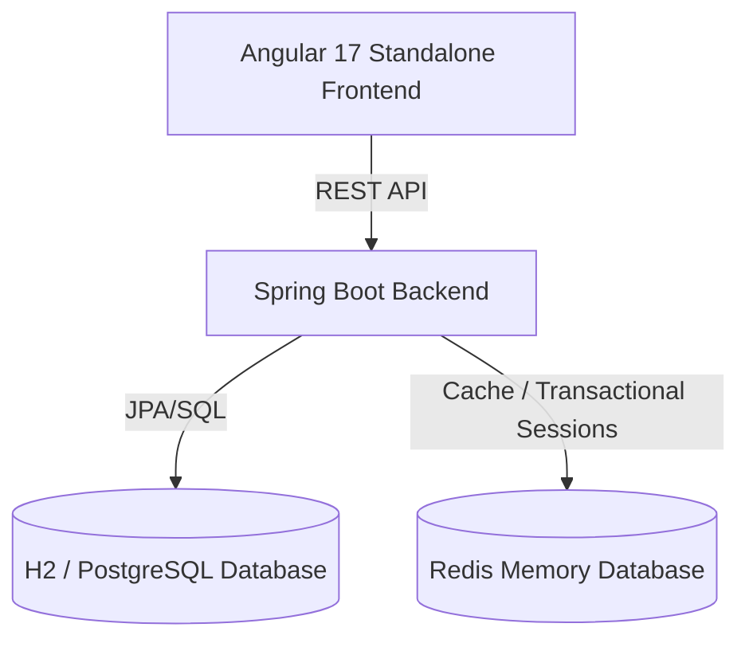

# Challenge E-Commerce Application (Gila)

An enterprise-grade e-commerce application exercise demonstrating contract-first development, bulk async imports, Redis transactional state management, and modern component architectural design.

---

## Technical Stack & Architecture



### 1. Backend Core Features
- **Products Catalog**: Standard RESTful endpoints for listing, filtering, and CRUD operations.
- **Bulk CSV Product Import**: Asynchronous import queue utilizing multi-threaded batch operations. Provides polling endpoints for real-time progress tracking (`QUEUED`, `PROCESSING`, `COMPLETED`, `FAILED`).
- **Redis Shopping Cart**: High-performance cart management utilizing transactional Redis sessions mapped to authenticated user sessions.
- **Purchase Checkout**: Validates product stock and records purchase logs, with transaction rollback.
- **UAT System Reset**: Administrator-exclusive endpoint (`DELETE /api/v1/orders/clear`) to flush all logs and reset catalog items back to defaults for evaluation.

### 2. Frontend Core Features
- **Angular 17 Standalone**: Heavy utilization of signals, lazy route loading, and standalone directives.
- **Thematic Directory Structure**: Clean classification of presentation layers (`app/components`), state layers (`app/services`), route managers (`app/pages`), and test suites (`src/tests`).
- **Sass 7-1 Architecture**: Highly modular, centralized CSS design system.
- **Centralized Constants & Enums**: Clear separation of concern for UI texts, routing configurations, and type mappings.

---

## Running Locally

Select one of the three options below to launch the project:

### Option A: Complete Docker Compose Orchestration (Recommended for Demos)
Starts all required services (Postgres, Redis, Kafka, Backend API, and Nginx Frontend) in a single command.
```bash
docker compose up --build -d
```
*   **Web App:** `http://localhost/` (exposes the Nginx server on port 80).
*   **API Documentation:** `http://localhost:8080/swagger-ui/index.html`.
*   **Access Credentials:** Check the local ignored [demo-guide.md](file:///c:/Users/leocg/Documents/GitHub/challenge-ecommerce-gila/demo-guide.md) file for testing logins and using the test accounts panel.

### Option B: Fast Docker Launch (Using Host Compilation)
Bypasses slow, first-time container compilation times by building natively on your host machine first (which uses warm local Maven/NPM caches) and then spinning up the Docker images:
*   **On Windows PowerShell:**
    ```powershell
    .\start-environment-fast.ps1
    ```
*   **On Linux/macOS:**
    ```bash
    ./start-environment-fast.sh
    ```

### Option C: Manual Services Run
1. Start your local **Redis** instance (port `6379`) and **PostgreSQL** or H2 instance.
2. Start the Spring Boot backend:
   ```bash
   mvn clean spring-boot:run
   ```
3. Start the Angular dev server:
   ```bash
   cd frontend
   npm install
   npm start
   ```
   Access the UI at `http://localhost:4200/`.

---

## Static Code Quality & Verification

To enforce enterprise-grade code cleanliness, the project integrates static code checkers and a pre-push validation script.

### 1. PMD & Checkstyle (Backend)
PMD and Checkstyle analyses run automatically during the Maven `validate` build phase.
*   **Rulesets:** Defined in [config/checkstyle/checkstyle.xml](file:///c:/Users/leocg/Documents/GitHub/challenge-ecommerce-gila/config/checkstyle/checkstyle.xml) and [config/pmd/ruleset.xml](file:///c:/Users/leocg/Documents/GitHub/challenge-ecommerce-gila/config/pmd/ruleset.xml).
*   **Manual Trigger:**
    ```bash
    mvn checkstyle:check pmd:check
    ```

### 2. Pre-Push Local Verification
Before committing or pushing code, execute the local verification script to audit lints, execute Karma test suites, verify Pact files, compile Maven projects, and trigger PMD/Checkstyle/JUnit validations:
*   **On Windows PowerShell:**
    ```powershell
    .\verify-before-push.ps1
    ```
*   **On Linux/macOS:**
    ```bash
    ./verify-before-push.sh
    ```

---

## CI/CD Pipelines (GitHub Actions)

A modular, reusable GitHub Actions pipeline is configured under `.github/workflows/`:
1.  **Frontend Pipeline (`frontend.yml`):** Sets up Node.js, caches npm directories, runs lints/stylelints, executes Karma unit tests headlessly, generates Pact contracts, and uploads them as build artifacts.
2.  **Backend Pipeline (`backend.yml`):** Downloads the generated Pact contracts, sets up JDK 17, caches Maven libraries, compiles the project, verifies static rules (PMD/Checkstyle), and runs all JUnit/Pact tests.
3.  **Orchestrator (`ci.yml`):** Coordinates the execution sequence sequentially (Backend waits for Frontend) to enforce a strict fail-fast pipeline.
4.  **Deployment Pipeline (`deploy.yml`):** Build-caches Docker layers and pushes the final verified images to Docker Hub on every release push to `main`.

---

## Contract Testing (Pact Framework)

We utilize the **Pact contract testing framework** to ensure seamless Integration between our Angular consumer and Spring Boot provider.

### Consumer Tests (Angular)
*   Executed in a standalone isolated **Jest** runner (on ports `1234-1238`) to keep Jasmine unit tests unpolluted.
*   Run command:
    ```bash
    cd frontend
    npm run test:pact
    ```
*   Generates contract files under `frontend/pacts/`.

### Provider Tests (Spring Boot)
*   Verified against the Spring MVC controller slice using MockMvc.
*   Run command:
    ```bash
    mvn test -Dtest=PactProviderVerificationTest
    ```

