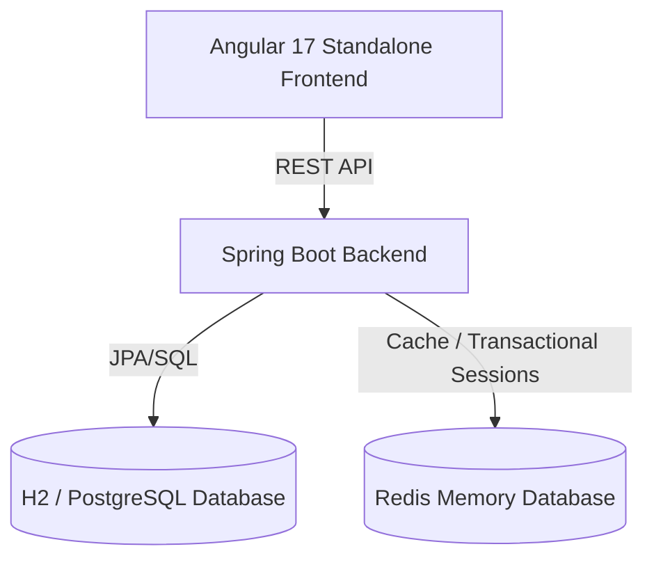

# Challenge E-Commerce Application (Gila)

An enterprise-grade e-commerce application exercise demonstrating contract-first development, bulk async imports, Redis transactional state management, and modern component architectural design.

---

## Technical Stack & Architecture



### 1. Backend Core Features
- **Products Catalog**: Standard RESTful endpoints for listing, filtering, and CRUD operations.
- **Bulk CSV Product Import**: Asynchronous import queue utilizing multi-threaded batch operations. Provides polling endpoints for real-time progress tracking (`QUEUED`, `PROCESSING`, `COMPLETED`, `FAILED`).
- **Redis Shopping Cart**: High-performance cart management utilizing transactional Redis sessions mapped to authenticated user sessions.
- **Purchase Checkout**: Validates product stock and records purchase logs, with transaction rollback.
- **UAT System Reset**: Administrator-exclusive endpoint (`DELETE /api/v1/orders/clear`) to flush all logs and reset catalog items back to defaults for evaluation.

### 2. Frontend Core Features
- **Angular 17 Standalone**: Heavy utilization of signals, lazy route loading, and standalone directives.
- **Thematic Directory Structure**: Clean classification of presentation layers (`app/components`), state layers (`app/services`), route managers (`app/pages`), and test suites (`src/tests`).
- **Sass 7-1 Architecture**: Highly modular, centralized CSS design system.
- **Centralized Constants & Enums**: Clear separation of concern for UI texts, routing configurations, and type mappings.

---

## Running Locally

Select one of the three options below to launch the project:

### Option A: Complete Docker Compose Orchestration (Recommended for Demos)
Starts all required services (Postgres, Redis, Kafka, Backend API, and Nginx Frontend) in a single command.
```bash
docker compose up --build -d
```
*   **Web App:** `http://localhost/` (exposes the Nginx server on port 80).
*   **API Documentation:** `http://localhost:8080/swagger-ui/index.html`.
*   **Access Credentials:** Check the local ignored [demo-guide.md](file:///c:/Users/leocg/Documents/GitHub/challenge-ecommerce-gila/demo-guide.md) file for testing logins and using the test accounts panel.

### Option B: Fast Docker Launch (Using Host Compilation)
Bypasses slow, first-time container compilation times by building natively on your host machine first (which uses warm local Maven/NPM caches) and then spinning up the Docker images:
*   **On Windows PowerShell:**
    ```powershell
    .\start-environment-fast.ps1
    ```
*   **On Linux/macOS:**
    ```bash
    ./start-environment-fast.sh
    ```

### Option C: Manual Services Run
1. Start your local **Redis** instance (port `6379`) and **PostgreSQL** or H2 instance.
2. Start the Spring Boot backend:
   ```bash
   mvn clean spring-boot:run
   ```
3. Start the Angular dev server:
   ```bash
   cd frontend
   npm install
   npm start
   ```
   Access the UI at `http://localhost:4200/`.

---

## Static Code Quality & Verification

To enforce enterprise-grade code cleanliness, the project integrates static code checkers and a pre-push validation script.

### 1. PMD & Checkstyle (Backend)
PMD and Checkstyle analyses run automatically during the Maven `validate` build phase.
*   **Rulesets:** Defined in [config/checkstyle/checkstyle.xml](file:///c:/Users/leocg/Documents/GitHub/challenge-ecommerce-gila/config/checkstyle/checkstyle.xml) and [config/pmd/ruleset.xml](file:///c:/Users/leocg/Documents/GitHub/challenge-ecommerce-gila/config/pmd/ruleset.xml).
*   **Manual Trigger:**
    ```bash
    mvn checkstyle:check pmd:check
    ```

### 2. Pre-Push Local Verification
Before committing or pushing code, execute the local verification script to audit lints, execute Karma test suites, verify Pact files, compile Maven projects, and trigger PMD/Checkstyle/JUnit validations:
*   **On Windows PowerShell:**
    ```powershell
    .\verify-before-push.ps1
    ```
*   **On Linux/macOS:**
    ```bash
    ./verify-before-push.sh
    ```

---

## CI/CD Pipelines (GitHub Actions)

A modular, reusable GitHub Actions pipeline is configured under `.github/workflows/`:
1.  **Frontend Pipeline (`frontend.yml`):** Sets up Node.js, caches npm directories, runs lints/stylelints, executes Karma unit tests headlessly, generates Pact contracts, and uploads them as build artifacts.
2.  **Backend Pipeline (`backend.yml`):** Downloads the generated Pact contracts, sets up JDK 17, caches Maven libraries, compiles the project, verifies static rules (PMD/Checkstyle), and runs all JUnit/Pact tests.
3.  **Orchestrator (`ci.yml`):** Coordinates the execution sequence sequentially (Backend waits for Frontend) to enforce a strict fail-fast pipeline.
4.  **Deployment Pipeline (`deploy.yml`):** Build-caches Docker layers and pushes the final verified images to Docker Hub on every release push to `main`.
    
    > [!NOTE]
    > **Docker Hub CD Configuration:**
    > To allow the deployment pipeline to succeed, configure the following secrets in your GitHub repository settings (`Settings -> Secrets and variables -> Actions`):
    > * `DOCKER_USERNAME`: Your Docker Hub registry username.
    > * `DOCKER_TOKEN`: A Personal Access Token (PAT) generated in your Docker Hub account settings.
    > 
    > If these secrets are not configured, the CD workflow will fail at the login stage. This failure is safe to ignore for local-only evaluations and does not impact the CI validation workflow (`ci.yml`).

---

## Contract Testing (Pact Framework)

We utilize the **Pact contract testing framework** to ensure seamless Integration between our Angular consumer and Spring Boot provider.

### Consumer Tests (Angular)
*   Executed in a standalone isolated **Jest** runner (on ports `1234-1238`) to keep Jasmine unit tests unpolluted.
*   Run command:
    ```bash
    cd frontend
    npm run test:pact
    ```
*   Generates contract files under `frontend/pacts/`.

### Provider Tests (Spring Boot)
*   Verified against the Spring MVC controller slice using MockMvc.
*   Run command:
    ```bash
    mvn test -Dtest=PactProviderVerificationTest
    ```

---

## Decisiones de Diseño y Alcance del Proyecto / Project Design Decisions & Scope

### Español
Intente utilizar todas las tecnologias que podrian ayudar a un e-commerce, ademas de aprovechar para agregar analiticas que se utilizan en este tipo de aplicaciones, asimismo aplicar reglas basicas de seguridad tanto en los endpoints como en el flujo de la aplicacion, tambien intente agregar tecnologias que ayuden a la calidad del codigo pero aumentaban mucho el tiempo de dockerizacion. Agregue un posible pipeline para el deploye en produccion, por ahora no funciona, pero se dejan las instrucciones en caso de que se tengan las credenciales necesarias. Decidi agregar tambien un bot que solo conteste preguntas sobre los productos, esto para incluir el uso de IA en la aplicacion, tmb inclui multilenguaje (ingles y español por ahora), el diseño que le di al front fue generico y deje que la IA lo decidiera al no verlo prioritario en esta entrega.
Tambien se incluye el uso de redis para la mejora de la velocidad utilizandolo como cache, y un brocker de apache kafka para que nos ayude con el performance cuando existan muchos productos por procesar.
En el front utilice sass para los estilos y le di estructura de patron 7-1, ademas tanto en front como en back estan utilizando Spec Driven Development y por lo tanto tengo una especificacion de contrato que ayuda a la IA a que su desarrollo tenga fronteras visibles y no vaya a alucinar.
En los pipelines de continuos integration trate de que fueran lo mas optimizados para que fueran lo mas rapido posible, ahorita en local los tiempos tienden a ser entre 90 y 150 segundos.
Una ultima cosa, por ahora solo hay dos usuarios que son de prueba y se agregaron en el login, el customer y el admin, ambos funcionan diferente de tal manera que se note la distincion, un ejemplo es que el admin no puede hacer compras, y el customer no puede agregar productos.

### English
I tried to use all the technologies that could help an e-commerce, in addition to taking the opportunity to add analytics that are typically used in these kinds of applications. Furthermore, I applied basic security rules both on the endpoints and in the application flow. I also tried to add technologies that assist with code quality, but they significantly increased the dockerization time. I added a potential pipeline for production deployment; it doesn't work for now, but instructions are provided in case the necessary credentials are available. I decided to also include a chatbot that only answers product-related questions to incorporate AI usage in the application. Additionally, I included multi-language support (English and Spanish for now). The design given to the frontend was generic, letting the AI decide it, as it was not considered a priority for this delivery.
The project also includes the use of Redis for speed improvement by using it as a cache, and an Apache Kafka broker to assist with performance when there are many products to process.
On the frontend, I used Sass for styling with a 7-1 pattern structure. Additionally, both the frontend and backend utilize Spec-Driven Development; hence, I have a contract specification that helps the AI keep its development within visible boundaries and avoid hallucinations.
I tried to keep the Continuous Integration pipelines as optimized as possible to make them run as fast as possible; currently, local build times tend to range between 90 and 150 seconds.
One last thing: for now, there are only two test users added at login, the customer and the admin. Both function differently to make their distinction clear. For example, the admin cannot make purchases, and the customer cannot add new products.

